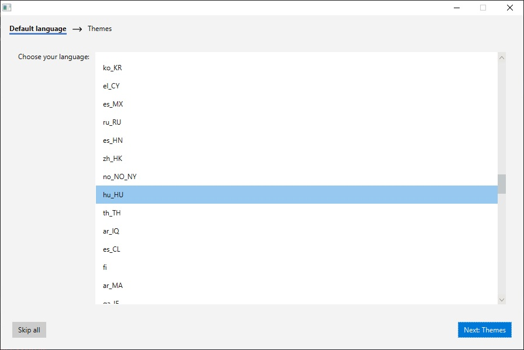
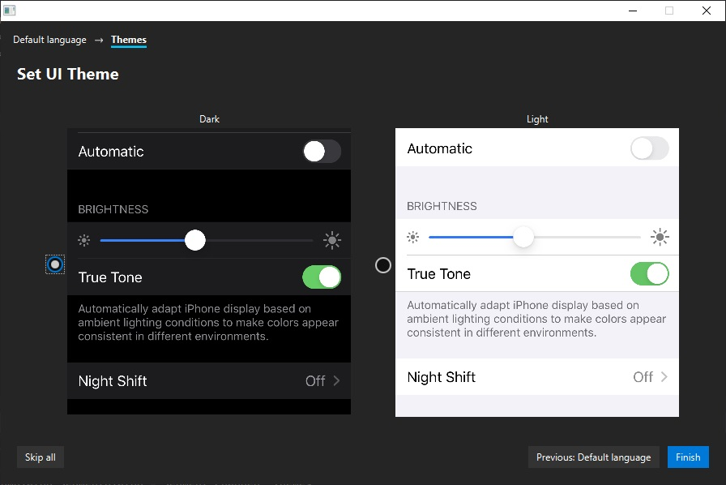

# SegmentDialogFX

Library for creating wizard-like dialogs in javaFX easily.

Provides also:
 * Internationalization
 * Easy styling through css

A demo is available in the [test](src/test) module.

<table>
<tr>
<td> 

 

</td>

<td> 

 

</td>
</tr>
</table>

